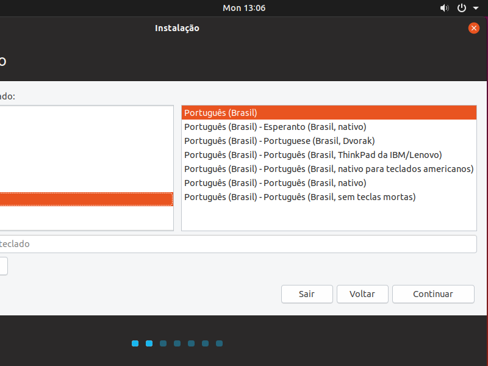

## Software Livre - Trabalho Linux

                                        Passo a Passo da Instalação do Ubuntu.

Bom para fazermos a instalação do Ubuntu, temos que fazer o download da ISO.

Primeiro entramos no site do Ubuntu - https://www.ubuntu.com/ e vamos clicar no menu Download

Vai abrir essa página clique em uma das duas versões mais atualizadas. (OBS: Lembrando que são 64bits).

Depois de baixado, pode colocar em um Pen Drive Bootável, em uma mídia física ou utilizado em máquina virtual. (OBS: na internet você acha passo a passo de cada um deles).

                                         Vamos começar a instalação do Ubuntu
                                         
Primeiro damos boot para instalar-mos o Ubuntu.

Quando abrir , ele pedirá para selecionar a linguagem.

Depois de selecionado, clicamos em Instalar o Ubuntu.

Na próxima tela, selecionamos o teclado a ser utilizado e clicamos em avançar.

