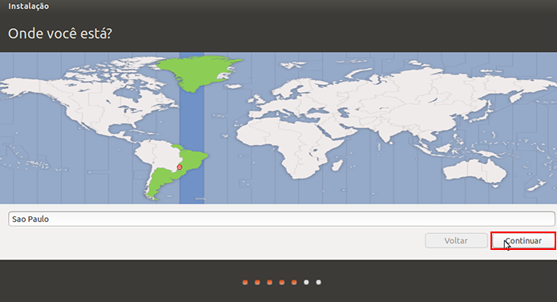
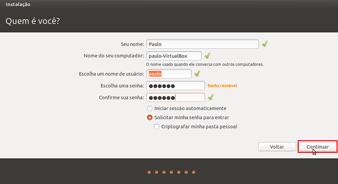
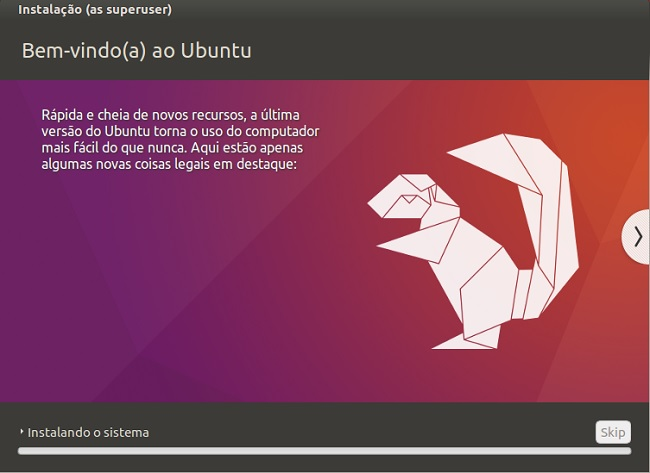

## Software Livre - Trabalho Linux

                                        Passo a Passo da Instalação do Ubuntu.

Bom para fazermos a instalação do Ubuntu, temos que fazer o download da ISO.

Primeiro entramos no site do Ubuntu - https://www.ubuntu.com/ e vamos clicar no menu Download

Vai abrir essa página clique em uma das duas versões mais atualizadas. (OBS: Lembrando que são 64bits).

Depois de baixado, pode colocar em um Pen Drive Bootável, em uma mídia física ou utilizado em máquina virtual. (OBS: na internet você acha passo a passo de cada um deles).

                                         Vamos começar a instalação do Ubuntu
                                         
Primeiro damos boot para instalar-mos o Ubuntu.

Quando abrir , ele pedirá para selecionar a linguagem.

Depois de selecionado, clicamos em Instalar o Ubuntu.

Na próxima tela, selecionamos o teclado a ser utilizado e clicamos em continuar.

Nessa tela, a instalação que aplicativos deseja utilizar, no meu caso, vou fazer a instalação normal e clicamos em continuar.

Nessa tela, escolhemos o tipo de instalação, no próprio ubuntu ele explica todos os tipos de instalação, mais como a minha e básica, vou selecionar a primeira e clico em instalar agora.

Ele vai perguntar se deseja criar manualmente as partições do Ubuntu ou deixar o Ubuntu fazer as partições, como e básica, deixo como está e clico em continuar.

Nessa tela ele pedi para selecionar a região, para definir o horário.

Depois ele pedi para criar login e senha para poder logar no Ubuntu.

Depois ele irá começar a instalação.

Depois da conclusão da instalação, ele vai pedir entra com login e senha criados.

Ubuntu instalado e pronto para ser utilizado. 

Obrigado pela vizualização.

